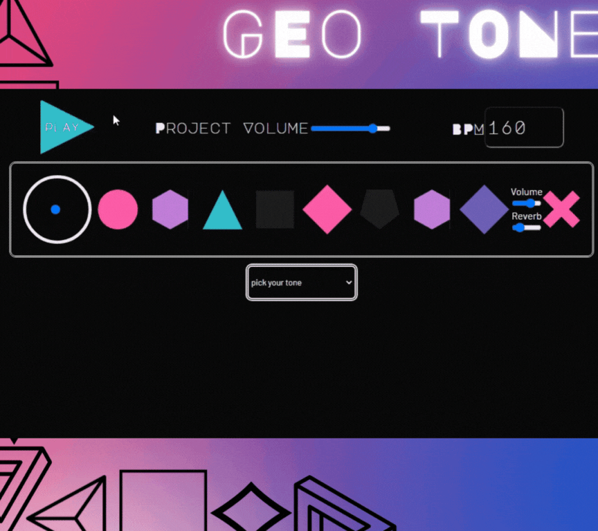

# About Geo Tone

**Geo Tone** is a browser-based audio sequencer built on React and supported by Reactronica, an incredible wrapper library for Tone.js made by [@unkleho](https://github.com/unkleho/reactronica).

This fork of [the original Geo Tone](https://github.com/geo-tone/geo-tone-frontend) (built by our small development team in spring 2022) also featured a backend using PostgreSQL and Express to store user-created projects, manage user data, and hash and encrypt information in a custom API. While these features will likely make a return in future updates, the original application proved challenging to navigate for first-time users - counter to our mission to make an easy-to-play, _accessible_ sequencer - so, we decided to open it up!

Our current approach - letting Geo Tone exist purely as a frontend tool - drives experimentation and makes new features easier to implement, too; here's an idea of what to expect in the near future:

- Freeform "piano-like" keyboard module (_in-progess_)
- Waveform visualizer
- Drum machine / sequencing
- Improved per-channel and global FX
- ...and more!

Most of all, **Geo Tone** exists to make music fun and visually-appearling - letting aspiring musicians and artists make dynamic, reactive, and unique audio-visual experiences all their own.

# Dependencies

- [Tone.js](https://tonejs.github.io/)
- [Reactronica](https://reactronica.com/)
- [Framer Motion](https://www.framer.com/motion/)

# Team Members

> | Contributing Team Members | Github                                       | LinkedIn                                                 |
> | ------------------------- | -------------------------------------------- | -------------------------------------------------------- |
> | Minoka Kakizaki           | [Github](https://github.com/kakizaki55)      | [LinkedIn](https://www.linkedin.com/in/minoka-kakizaki/) |
> | Jordan Laurent            | [Github](https://github.com/jlaurentpdx)     | [LinkedIn](https://www.linkedin.com/in/jlaurentpdx/)     |
> | Michelle Nygren           | [Github](https://github.com/michellerenehey) | [LinkedIn](https://www.linkedin.com/in/michellenygren/)  |
> | Forest Heims              | [Github](https://github.com/forestheims)     | [LinkedIn](https://www.linkedin.com/in/forestheims/)     |

# Feedback

Questions? Issues? Features that you'd like to see or contribute? We would love to hear from you!

Feel free to contact Jordan at [jlaurent.pdx@gmail.com](jlaurent.pdx@gmail.com) and let us know what you think.
